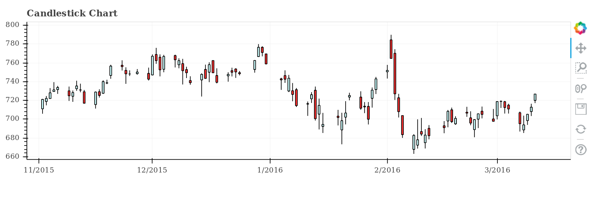

# Stocks-Simple-Chart

Simple chart built in python using the bokeh library to display the stock market progress for a specific company on a specific range of dates.

The chart will display for each day:

    1. a line capturing the minimum and maximum value
    2. a rectangle to display the closing value measured to the opening value (the rectangle will be red if the closing value was less than the opening one).

The project was developed following the course "The Python Mega Course" on Udemy.

A screenshot of the project:

